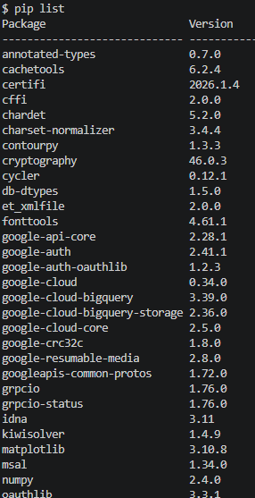
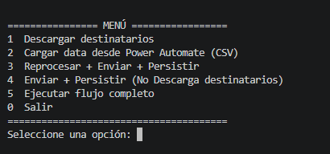
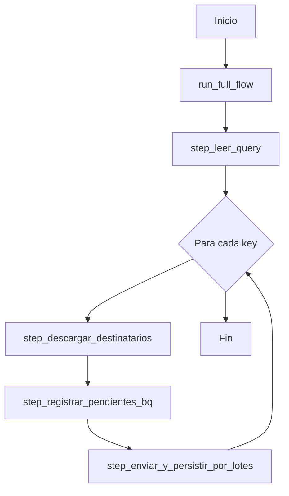

# Documentación del Proyecto - Validaciones Teams

## 📋 Tabla de Contenidos

1. [Descripción General](#descripción-general)
2. [Estructura del Proyecto](#estructura-del-proyecto)
3. [Configuración](#configuración)
4. [Módulos Principales](#módulos-principales)
5. [Archivos de Utilidad](#archivos-de-utilidad)
6. [Flujo de Ejecución](#flujo-de-ejecución)

---

## 📌 Descripción General

Este proyecto es una aplicación Python diseñada para validar datos de equipos en Microsoft Teams. Integra:
- **BigQuery**: Para almacenamiento y procesamiento de datos
- **Power Automate**: Para envío de formularios adaptables
- **SharePoint**: Para gestión de archivos (comentado en la implementación actual)
- **Version Python**: Para el proyecto se uso Python 3.14

El sistema descarga destinatarios, procesa datos, envía validaciones y persiste respuestas.

## Recomendaciones de Instalación
- Instalar Python 3.14 o superior (En teoria funciona con version 3.12 o Superior)
- Instalar y Configurar [Google SDK](https://docs.cloud.google.com/sdk/docs/install-sdk?hl=es-419)

- Definir variables de Entorno en archivo ".env". (Sección Configuración)
- Crear la tablas en Bigquery segun la estructura SQL del archivo "create_table.sql". usa el dataset y project-ID definido en archivo ".env"
- Crear ambiente virtual en terminal CMD
    ```bash
    python -m venv .venv
    ```
- Instalar las librerias del archivo 'requirements.txt'
    ```bash
    pip install -r requirements.txt
    ```
- Ejecuta este comando para validar que las librerias se instalaron correctamente
    ```bash
    pip list
    ```
    

- Ejecuta el archivo main.py para validar que todo este OK. Deberias visualizar un Menú de Opciones.

  

---

## 📁 Estructura del Proyecto

```
Validaciones_teams/
├── main.py                          # Punto de entrada - menú interactivo
├── test.py                          # Script de pruebas
├── create_table.sql                 # Scripts SQL para crear tablas
├── requirements.txt                 # Dependencias del proyecto
├── read.md                          # Readme del proyecto
│
├── app/
│   ├── __init__.py
│   ├── bigQuery/                    # Módulo de integración con BigQuery
│   │   ├── __init__.py
│   │   ├── bigquery_repository.py   # Repositorio para operaciones en BQ
│   │   ├── client/
│   │   │   └── client.py            # Cliente de BigQuery
│   │   └── merge_config/
│   │       └── merge_config.py      # Configuración MERGE para tablas
│   │
│   ├── flow/                        # Orquestación del flujo principal
│   │   ├── __init__.py
│   │   └── flow.py                  # Funciones de flujo (7 pasos principales)
│   │
│   ├── json_schema/                 # Esquemas JSON para validación
│   │   ├── ingles_schema.json
│   │   ├── spanish_schema.json
│   │   └── team_schema.json
│   │
│   ├── processData/                 # Procesamiento de archivos
│   │   ├── __init__.py
│   │   └── read_data.py             # Clase ProcessFile para lectura CSV
│   │
│   ├── sharepoint/                  # Integración SharePoint (comentada)
│   │   └── client/
│   │       ├── __init__.py
│   │       └── client.py
│   │
│   ├── teams_validation_service/    # Servicio de validación Teams
│   │   ├── __init__.py
│   │   ├── cross_check.py           # Validación cruzada de datos
│   │   ├── fuente_de_la_verdad.py   # Lectura y generación de tarjetas adaptables
│   │   └── http.py                  # Envío de solicitudes HTTP
│   │
│   └── utills/                      # Funciones de utilidad
│       └── utills.py
│
├── config/                          # Configuración del proyecto
│   ├── config.py                    # Configuración general (Pydantic)
│   ├── log_config.py                # Configuración de logging
│   └── querys.json                  # Queries dinámicas
│
├── data/                            # Datos del proyecto
│   ├── querys/                      # Queries reutilizables
│   ├── destinatarios/               # CSVs descargados de usuarios
│   │   ├── usuarios_agregados.csv
│   │   ├── usuarios_ingles.csv
│   │   ├── usuarios_spanish.csv
│   │   └── respaldo/
│   ├── query_sql/                   # Archivos SQL para BigQuery
│   │   ├── fuente_de_la_verdad.sql
│   │   ├── usuarios_agregados.sql
│   │   ├── usuarios_ingles.sql
│   │   └── usuarios_spanish.sql
│   └── resultado/
│       └── resultado.csv            # Resultados del procesamiento
│
└── logs/                            # Logs de ejecución
    └── app.log.1                    # Archivos de log rotativo
```

---

## ⚙️ Configuración

### `config/config.py`

Clase `Settings` (Pydantic BaseSettings) que gestiona la configuración del proyecto:

| Variable | Tipo | Descripción |
|----------|------|-------------|
| `project_prod` | str | ID de proyecto GCP producción |
| `project_qa` | str | ID de proyecto GCP QA |
| `url_p_automate` | str | URL de Power Automate |
| `bigquery_sandbox_qa` | str | Dataset sandbox en BigQuery QA |
| `table_sandbox_qa` | str | Tabla sandbox en BigQuery |
| `table_sandbox_result` | str | Tabla de resultados |
| `allowed_bq_tables` | dict | Mapeo de tablas permitidas |
| `path_output` | Path | Ruta de salida datos (data/) |
| `directory_querys` | Path | Ruta de configuración queries (config/) |
| `archivo_log` | str | Nombre del archivo log |
| `environment` | str | Ambiente (QA/PROD) |
| `correo_qa` | str | si environment = QA, se sobreescribe el correo destinatario |
| `timesleep` | int | Tiempo espera entre operaciones (segundos) |
| `chunk_size` | str | Numero de los registros que se van a procesar por cada iteracion |

**Lectura desde `.env`**: La clase lee automáticamente variables desde archivo `.env` en la raiz del proyecto

### 'template .env'
```.env
project_prod="tc-sc-bi-bigdata-edp-prod"
project_qa="tc-sc-bi-bigdata-edp-qa"
url_p_automate="url:http:/linkxxxxxxx"

#########################
bigquery_sandbox_qa="sbox_jcarrion"
table_sandbox_qa="team_validation_data"
table_sandbox_result="response_validation_data"

##########################
path_result="data/resultado/"
path_output="data/destinatarios/"
directory_querys="config/querys.json"

archivo_log="project_prod"

##########################
environment="project_prod"

##########################
CORREO_QA="correo_prueba@correo.cl"

##########################
timesleep=10
chunk_size=10
```
### `config/log_config.py`

Clase `registroLOG` que configura el sistema de logging:

- **Handlers**: Consola + archivo rotativo
- **Máximo archivo**: 10 MB
- **Backups**: 5 archivos históricos
- **Encoding**: UTF-8
- **Formato**: `%(asctime)s - %(name)s - %(levelname)s - %(message)s`

---

## 📦 Módulos Principales

### 1. **main.py** - Punto de Entrada

Menú interactivo con 6 opciones:

| Opción | Función | Descripción |
|--------|---------|-------------|
| 1 | `step_descargar_destinatarios()` | Descarga destinatarios desde BigQuery |
| 2 | `step_cargar_data_automate()` | Carga CSV desde Power Automate |
| 3 | Flujo completo de descarga | Descarga + registro + envío + persistencia |
| 4 | Flujo parcial | Solo registro + envío + persistencia (sin descarga) |
| 5 | `run_full_flow()` | Ejecuta flujo completo automático |
| 0 | Salir | Cierra la aplicación |

**Estructura**: Menu loop con validación de entrada

---

### 2. **app/flow/flow.py** - Orquestación Principal

Contiene 7 funciones principales que orquestan el flujo:

#### `step_leer_query(key: str | None) → Tuple[bool, Dict]`
- Lee configuración de queries desde JSON
- Si no se proporciona key, retorna todas las queries
- Retorna: (éxito, diccionario de queries)

#### `step_cargar_bigquery(df: pd.DataFrame, tabla: str, dropTable: bool) → bool`
- Carga DataFrame en BigQuery
- Valida tabla contra `allowed_bq_tables`
- Realiza `load_staging` y `merge_into`
- Maneja excepciones de BigQuery

#### `step_descargar_destinatarios(query_key: str, reprocesar: bool) → Tuple[bool, pd.DataFrame]`
- Descarga destinatarios usando `ListaUsuarios`
- Lee SQL file y JSON schema
- Aplica reprocesamiento si es necesario
- Retorna DataFrame con destinatarios

#### `step_registrar_pendientes_bq(archivo: pd.DataFrame) → bool`
- Registra pendientes en tabla `teams_validation_data`
- Campos: `status_code=0`, `success=False`, `timestamp`
- Ejecuta carga en BigQuery

#### `step_enviar_formularios(archivo: str) → bool`
- Lee destinatarios desde archivo
- Envía formularios adaptables vía HTTP
- Maneja respuestas

#### `step_cargar_data_automate(path: Path, archivo: str) → Tuple[bool, str]`
- Procesa CSV desde Power Automate
- Lee usando `ProcessFile`
- Carga en tabla `data_automate`

#### `step_enviar_y_persistir_por_lotes(archivo: str, chunk_size: int = 5) → bool`
- Envía destinatarios en lotes
- Procesa respuestas
- Persiste en BigQuery
- Maneja errores HTTP

---

### 3. **app/bigQuery/bigquery_repository.py**

Clase `BigQueryTableRepository` - Repositorio de datos en BigQuery

#### Constructor
```python
__init__(table: str, project_id: str, client)
```
- Inicializa cliente de BigQuery
- Carga settings (sandbox, proyecto)

#### Métodos Principales

**`read_query(query: str) → pd.DataFrame`**
- Ejecuta query de lectura
- Retorna DataFrame

**`load_staging(data: pd.DataFrame, dropTable: bool) → Tuple[bool, str]`**
- Carga datos a tabla staging (`stg_{table}`)
- Opcionalmente elimina tabla previa
- Retorna: (éxito, mensaje)
- Maneja: `BigQueryError`, `Exception`

**`merge_into(table_final: str, config: dict) → Tuple[bool, str]`**
- Ejecuta MERGE SQL en BigQuery
- Usa configuración desde `merge_config.py`
- Maneja PRIMARY KEY, INSERT, UPDATE, WHERE UPDATE
- Retorna: (éxito, mensaje)

---

### 4. **app/bigQuery/merge_config/merge_config.py**

Diccionario `MERGE_CONFIG` con configuración para dos tablas:

#### `teams_validation_data`
- **PK**: `request_id`
- **Columns**: request_id, destinatario, lista_colaboradores, status_code, success, timestamp
- **Update**: status_code, success, timestamp, lista_colaboradores
- **Where Update**: success = false

#### `response_validation_data`
- **PK**: `request_id`, `responseTime`
- **Columns**: request_id, messageId, messageLink, responseTime, submitActionId, responder_* fields, equipo_validado, falta_gente, edp_load_datetime
- **Update**: Todos los campos
- **Where Update**: Vacío (no aplica condición)

---

### 5. **app/bigQuery/client/client.py**

Clase `BigQueryClient` - Cliente para conexiones a BigQuery

#### Constructor
- Carga credenciales desde `config.py`
- Lee: `project_prod`, `project_qa`, `bigquery_sandbox_qa`

#### Métodos

**`ambientProd() → bigquery.Client`**
- Retorna cliente para entorno PRODUCCIÓN

**`ambientQA() → bigquery.Client`**
- Retorna cliente para entorno QA

---

### 6. **app/processData/read_data.py**

Clase `ProcessFile` - Procesamiento de archivos CSV

#### Constructor
```python
__init__(path: Path, archivo: str)
```

#### Métodos Principales

**`generate_hash(row, cols) → str`**
- Genera hash SHA256 basado en columnas específicas
- Normaliza: lowercase, strip
- Usa separador `|`

**`read_csv(parametros: dict) → Tuple[bool, str, pd.DataFrame]`**
- Lee archivo CSV con encoding automático
- Valida columnas esperadas
- Genera columna `row_hash`
- Agrega timestamp: `edp_load_datetime`
- Retorna: (éxito, mensaje, DataFrame)
- Excepciones: EmptyDataError, InvalidColumnName, DataError

---
### 7. **app/teams_validation_service/fuente_de_la_verdad.py**

Clase `ListaUsuarios` - "Fuente de la Verdad" del proyecto

#### Constructor
```python
__init__(name_file = None, project_id=settings.project_prod)
```

#### Métodos Principales

**`exec_query(reprocesar: bool, sql_file: Path, json_template: Path) → Tuple[bool, str, pd.DataFrame]`**

Flujo:
1. Lee archivo SQL
2. Ejecuta query en BigQuery
3. Agrupa resultados por manager
4. Para cada manager:
   - Clona template JSON
   - Genera equipo como opciones (ChoiceSet)
   - Reemplaza dinámicamente contenido
5. Si `reprocesar=True`: Filtra registros ya procesados
6. Guarda datos como CSV y Excel

Parámetros:
- `reprocesar`: bool = True → Compara con datos enviados previamente
- `sql_file`: Path → Ruta del SQL a ejecutar
- `json_template`: Path → Ruta del JSON template

**`_download_Data(data: pd.DataFrame) → Tuple[bool, str]`**
- Guarda datos en CSV y Excel
- Ruta: `{path_output}/{name_file}.csv|.xlsx`
---

### 8. **app/teams_validation_service/http.py**

Clase `EnvSolicitud` - Envío de solicitudes HTTP a Power Automate

#### Constructor
```python
__init__(file_dest: str)
```
- Configura paths de entrada/salida
- Crea sesión HTTP con retry automático

#### Métodos Principales

**`lista_destinatarios() → Tuple[bool, str, pd.DataFrame]`**
- Lee archivo Excel (.xlsx)
- Extrae destinatarios y mensajes
- Retorna: (éxito, mensaje, DataFrame)

**`_create_session() → requests.Session`**
- Crea sesión HTTP con retry (4 intentos)
- Backoff factor: 1 segundo
- Status codes reintentables: 429, 500, 502, 503, 504

**`_build_payload(request_id: str, destinatario: str, mensaje: str) → dict`**
- Construye payload JSON para envío
- Extrae colaboradores del mensaje

---
### 9. **app/teams_validation_service/cross_check.py**

Script de validación cruzada (parcialmente implementado en el archivo)

Incluye:
- Configuración de zona horaria GMT-4
- Conexión a BigQuery para validación
- Lectura de archivos CSV/Excel
- Queries de validación

---

### 10. **app/utills/utills.py** - Funciones Utilitarias

#### Funciones Principales

**`get_array(data: str, value: str = "choices") → list`**
- Extrae array de choices desde JSON de tarjeta adaptable
- Retorna lista de valores

**`get_date_time() → datetime`**
- Retorna timestamp UTC actual

**`get_encoding(ruta: Path) → str`**
- Detecta encoding del archivo usando `chardet`
- Default: UTF-8

**`read_sql_file(file_path) → Tuple[bool, str]`**
- Lee archivo SQL
- Retorna: (éxito, contenido SQL)

**`read_json_file(file_path) → dict`**
- Lee archivo JSON
- Retorna diccionario o {} si hay error

**`chunk_dataframe(df: pd.DataFrame, chunk_size: int) → generator`**
- Divide DataFrame en chunks
- Generador de tamaño fijo

**`generar_request_id(destinatario: str) → str`**
- Genera ID único de solicitud
- Hash SHA256: `{destinatario}|{mes}`

**`random_mail() → str`**
- Retorna email aleatorio de lista predefinida

**`validate_request_id(request_id: list) → pd.DataFrame`**
- Valida request IDs en BigQuery
- Retorna DataFrame de IDs válidos

**`reprocess(dfA: pd.DataFrame) → pd.DataFrame`**
- Filtra DataFrames previamente procesados
- Retorna solo registros nuevos

---

## 🔄 Flujo de Ejecución

### Flujo Principal (Opción 5 - Flujo Completo)



### Flujo Opción 3 - Reprocesar + Enviar + Persistir

```
1. step_leer_query()           → Obtiene configuración de queries
    ↓
2. step_descargar_destinatarios(reprocesar=True)  → Descarga de BQ + filtrado
    ↓
3. step_registrar_pendientes_bq()     → Registra como pendientes
    ↓
4. step_enviar_y_persistir_por_lotes()  → Envía y persiste respuestas
```

### Dentro de `step_descargar_destinatarios`:

```
1. Lee query SQL y JSON schema desde config
2. ListaUsuarios.exec_query():
   a. Ejecuta SQL en BigQuery
   b. Agrupa por manager
   c. Genera tarjetas adaptables
   d. Si reprocesar: Filtra ya procesados
   e. Guarda CSV/Excel
3. Retorna DataFrame de destinatarios
```

---

## 📊 Modelos de Datos

### DataFrame de Destinatarios
```
Columnas: request_id, destinatario, mensaje, status_code, success, timestamp
Tipos: str, str, json, int, bool, datetime
```

### DataFrame de Automate
```
Columnas: request_id, messageId, messageLink, responseTime, submitActionId, 
          responder_*, equipo_validado, falta_gente, edp_load_datetime, row_hash
```

### Tarjeta Adaptable
```json
{
  "type": "AdaptiveCard",
  "body": [
    {"type": "TextBlock", "text": "Validación de equipo - {manager_email}"},
    {
      "type": "Input.ChoiceSet",
      "choices": [
        {"title": "emp_name (email)", "value": "email"},
        ...
      ]
    }
  ]
}
```

---

## 🚀 Ejecución

### Iniciar Aplicación

```bash
# Activar entorno virtual
source .venv/Scripts/activate

# Ejecutar main
python main.py
```
---

## 📝 Archivos de Configuración

### `config/querys.json`
Define queries dinámicas por clave:
```json
{
  "usuarios_ingles": {
    "query_sql": "data/query_sql/usuarios_ingles.sql",
    "schema": "app/json_schema/ingles_schema.json"
  }
}
```

### `requirements.txt`
ver librerias en archivo "requirements.txt"
---

## 🔐 Consideraciones de Seguridad

1. **Credenciales BigQuery**: Usar `GOOGLE_APPLICATION_CREDENTIALS`
2. **Variables de entorno**: Almacenar en `.env` (no versionado)
3. **Logs**: Contienen información sensible (emails) - considerar enmascaramiento

---

## 📌 Notas Importantes

- **SharePoint**: Cliente comentado (no en uso actual)
- **Cross-check**: No se usa actualmente
- **Encoding automático**: Usa `chardet` para detectar encoding de archivos
- **Retry automático**: HTTP requests con 4 reintentos
- **Logging rotativo**: 5 archivos backup de 10 MB cada uno
- **Cambios en Tabla SQL**:  
  Cualquier modificación en la estructura de las tablas de BigQuery debe ser modificada en los siguientes archivos de configuración y definición:

  1. **Script de creación de tablas `create_table.sql`**  
     Archivo ubicado en la raíz de la aplicación. contiene la estructura de las tablas a poblar

  2. **Variable de entorno `allowed_bq_tables`**  
     Ubicada en: `config/config.py`. solo se considerara la modificación de las tablas que se encuentran en este diccionario

     ```python
     allowed_bq_tables: dict[str, str] = Field(
         default_factory=lambda: {
             "data_teams": "teams_validation_data",
             "data_automate": "response_validation_data"
         }
     )
     ```

  3. **Archivo de configuración de merges**
     Ubicado en: `app/bigQuery/merge_config/merge_config.py`. contiene la estructura válida con la que se realizara cualquier insert/update u otro cambio en las tablas BQ

      ```python
        MERGE_CONFIG = {
        ## este nombre de la tabla debe coincidir con "allowed_bq_tables" (Punto 2) 
        "teams_validation_data": {
            "pk": ["request_id"],
          #### solo esto inserta
            "columns": {
                "request_id": "s.request_id",
                "destinatario": "s.destinatario",
                "lista_colaboradores": "s.lista_colaboradores",
                "status_code": "s.status_code",
                "success": "s.success",
                "timestamp": "TIMESTAMP(s.timestamp)"
            },
          #### solo en estos campos se ejecuta un update
            "update":{
                "status_code": "s.status_code",
                "success": "s.success",
                "timestamp": "TIMESTAMP(s.timestamp)",
                "lista_colaboradores": "s.lista_colaboradores",
                },
            "where_update":{
                "success": "false",
                },
            "order_by":{
                "timestamp": "TIMESTAMP(s.timestamp)"
                }
        },

        "response_validation_data": {
            "pk": ["request_id","responseTime"],
            "columns": {
                "request_id": "s.request_id",
                "messageId": "s.messageId",
                "messageLink": "s.messageLink",
                "responseTime": "s.responseTime",
                "submitActionId": "s.submitActionId",
                "responder_objectId": "s.responder_objectId",
                "responder_tenantId": "s.responder_tenantId",
                "responder_email": "s.responder_email",
                "responder_userPrincipalName": "s.responder_userPrincipalName",
                "responder_displayName": "s.responder_displayName",
                "equipo_validado": "SPLIT(s.equipo_validado, ',')",
                "falta_gente": "s.falta_gente",
                "edp_load_datetime": "TIMESTAMP(s.edp_load_datetime)"
            },

            "update": {
                "request_id": "s.request_id",
                "messageId": "s.messageId",
                "messageLink": "s.messageLink",
                "responseTime": "s.responseTime",
                "submitActionId": "s.submitActionId",
                "responder_objectId": "s.responder_objectId",
                "responder_tenantId": "s.responder_tenantId",
                "responder_email": "s.responder_email",
                "responder_userPrincipalName": "s.responder_userPrincipalName",
                "responder_displayName": "s.responder_displayName",
                "equipo_validado": "SPLIT(s.equipo_validado, ',')",
                "falta_gente": "s.falta_gente",
                "edp_load_datetime": "TIMESTAMP(s.edp_load_datetime)"
        },
            "where_update":{
                "":""
                }
        ,
            "order_by":{
                "responseTime": "s.responseTime"
                }}}
      ```
---

## 📚 Dependencias Principales

- `pandas`: Manipulación de datos
- `pydantic`: Validación y configuración
- `google-cloud-bigquery`: Cliente de BigQuery
- `requests`: HTTP requests
- `chardet`: Detección de encoding
- `openpyxl`: Lectura de Excel
- `pytz`: Manejo de zonas horarias

---

**Última actualización**: May 20, 2026

